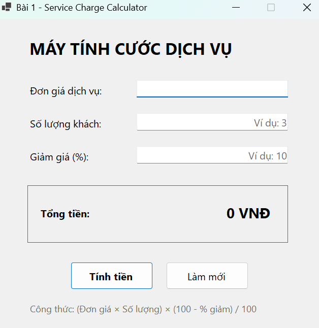
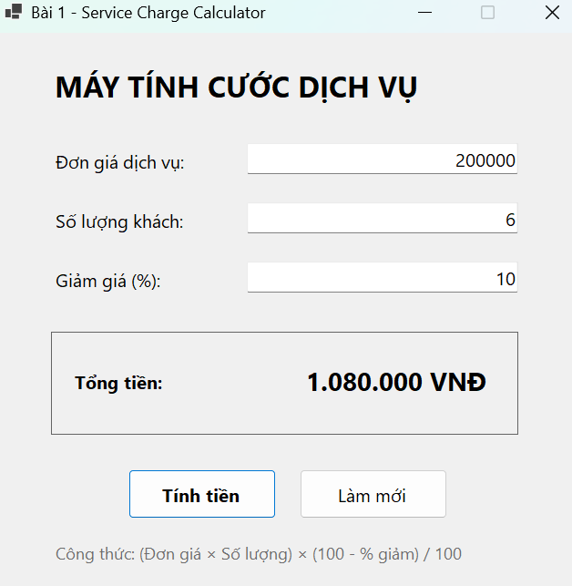
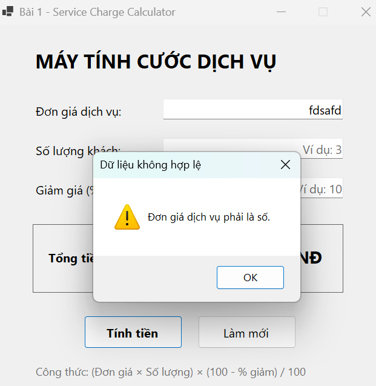

## THÔNG TIN SINH VIÊN
- **Họ và tên:** Nguyễn Văn An
- **Mã số sinh viên:** 24810320020
- **Lớp:** D19QTANM1
- **Tên môn học:** Laptrinh.net
- **Tên bài tập:** Bài 1 - Máy tính tính cước dịch vụ & Giảm giá

## CHỨC NĂNG
- Nhập đơn giá dịch vụ.
- Nhập số lượng khách.
- Nhập phần trăm giảm giá.
- Tính tổng tiền theo công thức:

`Tổng tiền = (Đơn giá × Số lượng) × (100 - % giảm) / 100`

- Kiểm tra dữ liệu sai hoặc để trống bằng `MessageBox`.
- Nút **Làm mới** xóa dữ liệu và đưa con trỏ về ô Đơn giá.
- TabIndex đã được sắp xếp: Đơn giá → Số lượng → Giảm giá → Tính tiền → Làm mới.

## KẾT QUẢ THỰC HÀNH

### 1. Ảnh màn hình giao diện chính

### 2. Ảnh màn hình chức năng thực thi / kết quả

### 3. Ảnh màn hình kiểm tra lỗi

